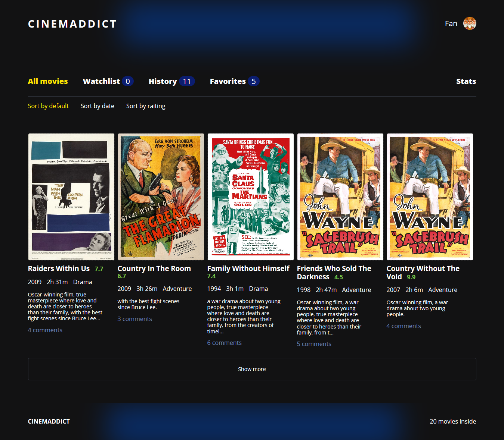
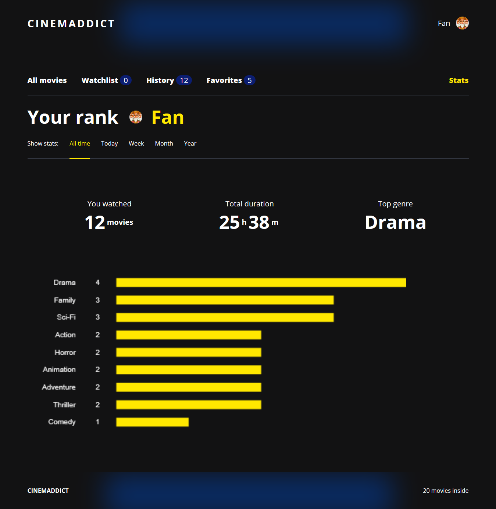

# Cinemaddict

SPA на чистом ES6, с применением ООП, MVC, observer.

---






---

### Функциональность

* Фильтрация и сортировка фильмов, возможность добавить фильм в избранное, добавить в список к просмотру, отметить как просмотренный
* Возможность просмотра статистики по просмотренным фильмам
* Открытие отдельной карточки фильма с возможностью добавлять и удалять комментарии

---

### Технологии

* ООП
* MVC
* REST
* AJAX
* Webpack
* moment
* chart.js

---

Установка пакетов:
```
npm install
```
Сборка:
```
npm build
```
Запуск:
```
npm start
```

---

<a href="https://htmlacademy.ru/intensive/ecmascript"></a>

Репозиторий создан для обучения на интенсивном онлайн‑курсе «[Профессиональный JavaScript, уровень 2](https://htmlacademy.ru/intensive/ecmascript)» от [HTML Academy](https://htmlacademy.ru).
